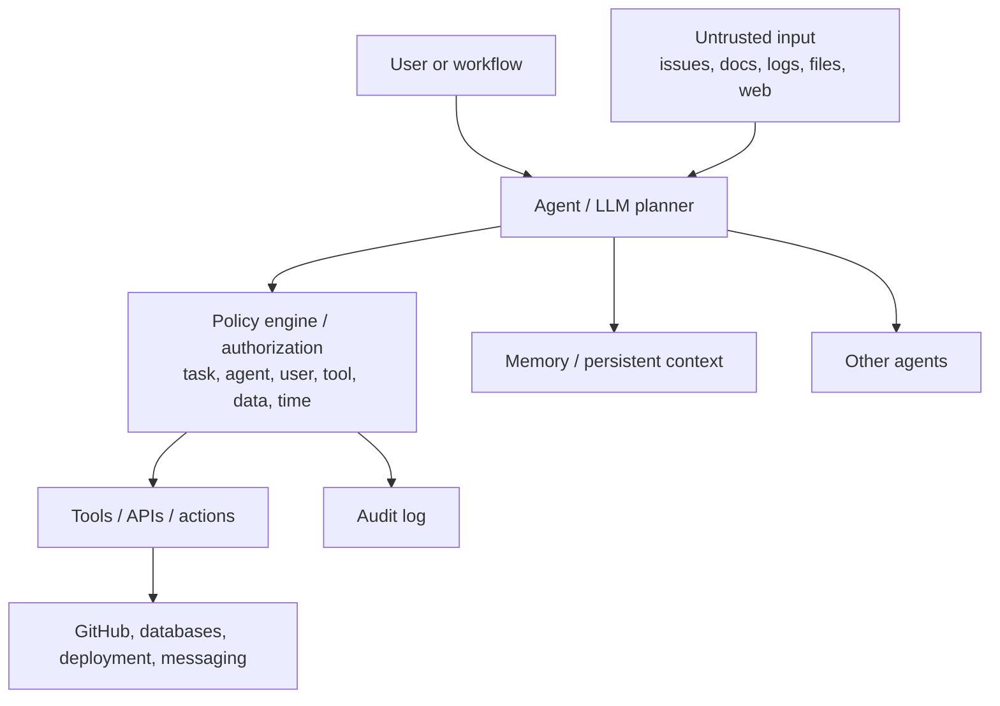

# Agentic Applications Security: OAS Top 10 for Agents

This Wiki explains the **OAS Top 10 for agentic applications** through a practical story:

> We build a small engineering support agent.  
> It starts by reading GitHub issues and internal documentation.  
> Then it gains tools, credentials, third-party integrations, code execution, memory, and other agents.  
> Each capability makes the agent more useful, but also creates a new security boundary.

The core mental model is:

> **Treat the model as an untrusted planner.**
>
> The model can reason, recommend, and propose actions.  
> The surrounding system must decide whether the action is allowed, isolate execution, record the decision, and stop the agent if needed.

---

## Why agents are different from normal LLM apps

A simple LLM application may be:

```text
user text in → LLM → text out
```

That is already a security surface, but your normal application security controls may cover a lot of it.

An agent is different because it can:

- call APIs
- read/write data
- run commands
- use credentials
- write memory
- communicate with other agents
- act autonomously over time

That changes the security boundary from “text output” to “authorized actions.”

---

## Core architecture idea



The important part is that the **model does not directly decide what is allowed**.

The model proposes.

The system authorizes.

---

## OAS Top 10 for Agentic Applications

| ID | Risk | What it means | Page |
|---|---|---|---|
| ASI-01 | Agent Goal Hijack | Untrusted input changes what the agent is trying to accomplish. | [03 ASI-01](https://github.com/alishahbaz/Agentic-Applications-Security/wiki03-ASI-01-Agent-Goal-Hijack) |
| ASI-02 | Tool Misuse | The agent uses a legitimate tool in a way that was not intended. | [04 ASI-02/03](https://github.com/alishahbaz/Agentic-Applications-Security/wiki04-ASI-02-03-Tool-Misuse-and-Credential-Abuse) |
| ASI-03 | Identity and Privilege Abuse | The agent uses a valid credential with too much access. | [04 ASI-02/03](https://github.com/alishahbaz/Agentic-Applications-Security/wiki04-ASI-02-03-Tool-Misuse-and-Credential-Abuse) |
| ASI-04 | Agentic Supply Chain Vulnerabilities | Third-party tools, prompts, MCP servers, or metadata change behavior. | [06 ASI-04/05](https://github.com/alishahbaz/Agentic-Applications-Security/wiki06-ASI-04-05-Supply-Chain-and-Code-Execution) |
| ASI-05 | Unexpected Code Execution | Untrusted text leads to dangerous command or code execution. | [06 ASI-04/05](https://github.com/alishahbaz/Agentic-Applications-Security/wiki06-ASI-04-05-Supply-Chain-and-Code-Execution) |
| ASI-06 | Memory and Context Poisoning | Bad information is saved and reused in future sessions. | [07 ASI-06/07](https://github.com/alishahbaz/Agentic-Applications-Security/wiki07-ASI-06-07-Memory-Poisoning-and-Inter-Agent-Trust) |
| ASI-07 | Insecure Inter-Agent Communication | One agent sends unsafe or unverified instructions to another agent. | [07 ASI-06/07](https://github.com/alishahbaz/Agentic-Applications-Security/wiki07-ASI-06-07-Memory-Poisoning-and-Inter-Agent-Trust) |
| ASI-08 | Cascading Failures | A small failure spreads and amplifies across agents and systems. | [08 ASI-08](https://github.com/alishahbaz/Agentic-Applications-Security/wiki08-ASI-08-Cascading-Failures) |
| ASI-09 | Human-Agent Trust Exploitation | A human approves an action based on misleading agent explanation. | [09 ASI-09/10](https://github.com/alishahbaz/Agentic-Applications-Security/wiki09-ASI-09-10-Trust-Exploitation-and-Rogue-Agents) |
| ASI-10 | Rogue Agents | An agent behaves outside its intended boundaries or authorized scope. | [09 ASI-09/10](https://github.com/alishahbaz/Agentic-Applications-Security/wiki09-ASI-09-10-Trust-Exploitation-and-Rogue-Agents) |

---

## The PocketOS incident in one sentence

A coding agent had a valid credential and enough access to delete production, even though nobody hacked it, stole a token, or performed prompt injection.

That is the starting point.

[Continue to Home](https://github.com/alishahbaz/Agentic-Applications-Security/wiki)
